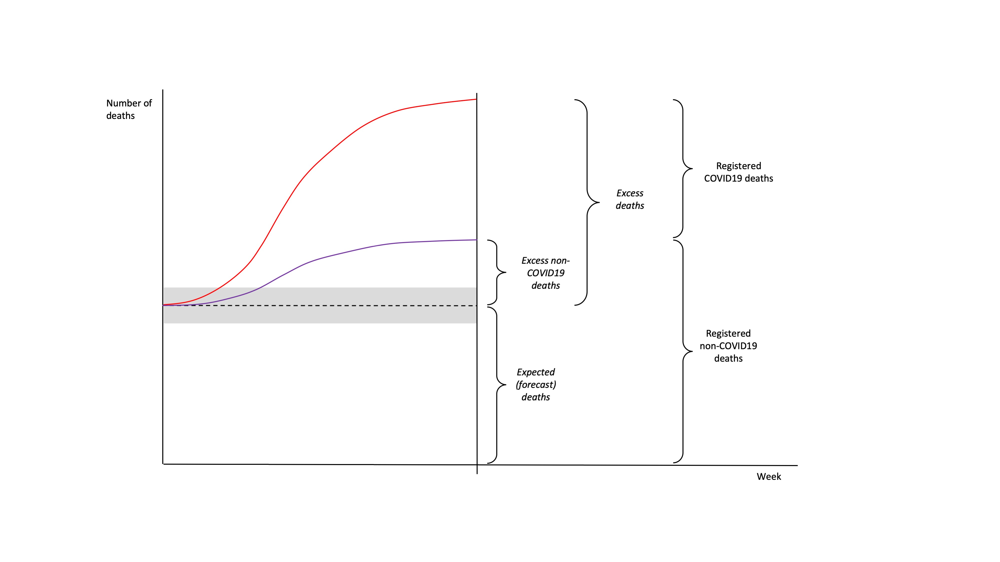
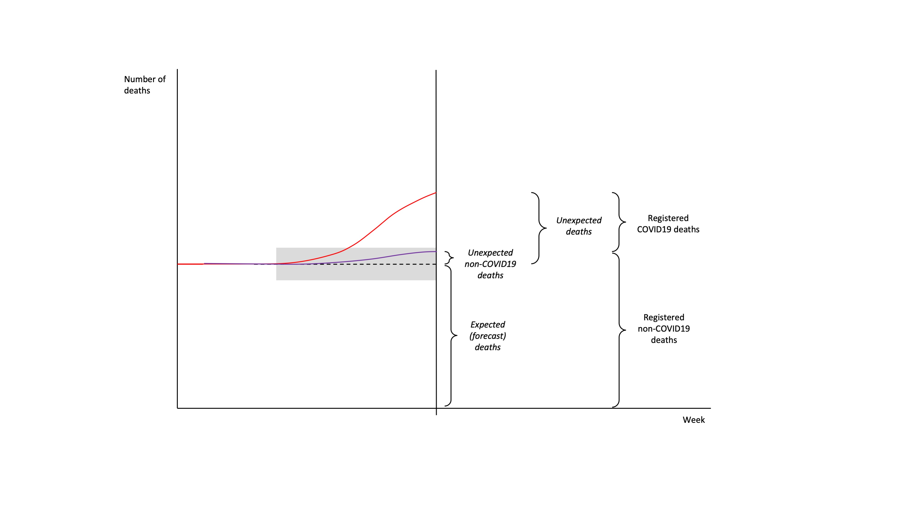
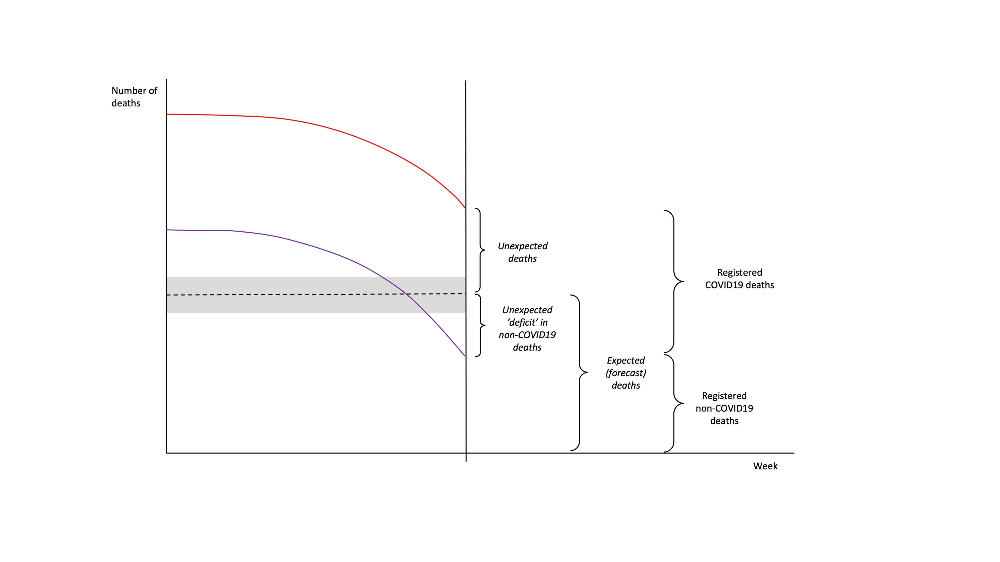

{width=700px}

Note: red line: all-cause registered deaths, purple line: registered non-COVID-19 deaths, dashed black line: expected (forecast) deaths with confidence interval; estimated quantities in italics

\
\

{width=700px}

\
\

{width=700px}
